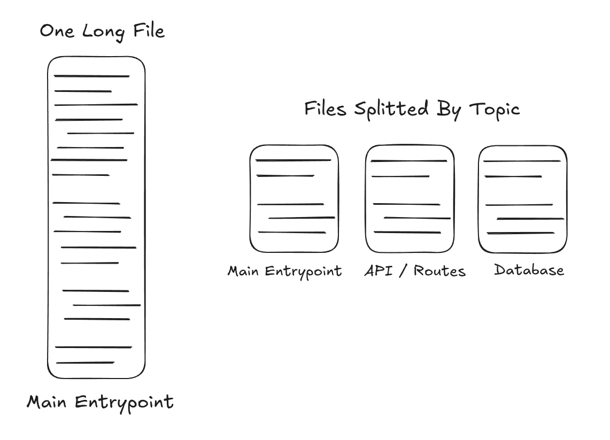

A friend recently sent me a tweet of Tsoding, a recreational programmer who creates cool videos on YouTube that I also enjoy watching. The tweet is as follows;



Although I don't fully agree with him, I understand the message to some extent. That is, you can work just as efficiently in a single file as you would in a repo with split files. I agree that it is possible, especially if you are someone like Tsoding.

I don't like seeing too many files clustering around like small satellite particles either. I think excessive use of new files is often correlated with some kind of boilerplate being followed (which is very common in Java, C#, or even C++ communities) and with code that's harder to trace. So, I too, usually prefer seeing related code kept together than just seperating them at every chance. That being said, I think, taking this idea of "not splitting pieces of code into separate files" to extreme is just as bad as those satellites making it harder to trace the code as you need to jump between files all the time.

# The Problem

**I think the main problem with both single-file and satellite-style codebases is that it's far easier for the person who wrote them to operate on them than it is for others trying to get adjusted.** That's because the original author already has an idea of what kinds of functions exist in the codebase, so they can just grep for things and navigate easily.

**Reading a codebase when you already know what exists beforehand, and reading one when you have no idea what you're going to encounter until you read it, is a HUGE difference. It's easy to overlook this and assume your code is simple to understand, especially if you're the one who wrote it recently.**

Let's say you've just joined a backend project and you are expected to develop a new endpoint. Compare a system where files are organized hierarchically according to their relevant topics (db, api, routes, entrypoint) with a system where there is a single, very long file. Which one do you think would be faster for you to figure out which places to start trying to understand for the feature you want to develop?

If you go with the first approach, you'll likely need to skim through the entire file to figure out where to add your new feature. But with the second approach, it's usually obvious where to look first. You might even be able to implement the feature without ever touching the other files.

Also, let's not forget that in addition to the cognitive benefits of using split files over a single long file, there are also practical advantages: splitting your codebase into multiple files reduces the likelihood of version control conflicts and allows AI tools to index and analyze your code more effectively.

# Finishing Notes

Among the projects I worked on this year, there were two I took over that involved these kinds of large single-file codebases. These were by far among the hardest codebases to adapt to. The mental burden was significantly greater compared to projects where the code was separated into modules across different files. I wouldn't say these single-file projects were especially complex or difficult. They weren't. And I wouldn't say the total lines of code were higher than in the more modular projects I've worked on, because they weren't either. I think the main issue is that jumping into a large block of code without any clear structure or signposting just makes it harder to navigate.

Which, I believe, is true not just in programming, but in reading in general. Imagine having to read a textbook without titles, chapters, or any structure. **Files may be "OS-level constructs anyway", but so are many other constructs from different domains that are useful and helpful to us.**
