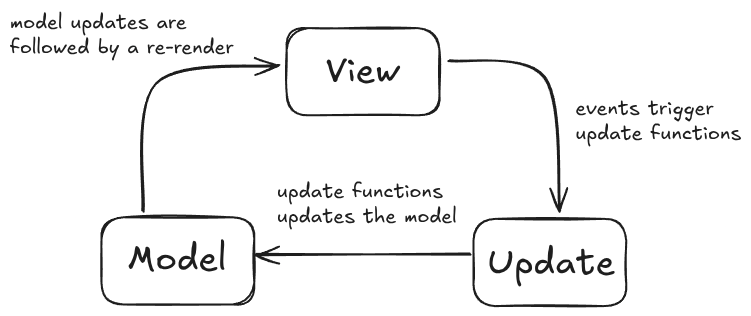

This essay presents a list of reflections on my attempts to create a simple workflow for building front-end applications using vanilla JavaScript. I first discuss what it was like to code when I first started programming and the things that I enjoyed about it. Then I walk through several approaches I tried in the pursuit of simplicity and also share the problems I ran into meanwhile. Later, I show how we can make use of libraries such as [Hyperscript](https://github.com/hyperhype/hyperscript) and [Snabbdom](https://github.com/snabbdom/snabbdom) to resolve those issues without giving up on our simplicity ideals.

I don't aim to convince anyone to adopt the workflows presented in this essay but simply to share my experience with others who might share the same concerns about simplicity.

# When JavaScript Was Just JavaScript

I remember the times back in high school when I used to build recreational projects [^projects] just for fun. I'd write everything directly in the browser, sometimes maybe everything in one big `index.html` file. No build tools. No frameworks. No libraries. Just plain HTML. Some CSS. And native JavaScript. The code quality was terrible. Global variables are everywhere. Different functions would change the shared state in a way making it very hard to trace what was going on. Bad variable names are all over the place. Not following a consistent writing style, etc. I wasn’t aware of the "best practices" I am aware of now. YET, despite my incompetency in the subject, I was able to build things that genuinely interested me using only the limited native JavaScript tools I had. And the good part was that I was able to understand what was going on!

[^projects]: [Physics Simulator](https://kugurerdem.github.io/physics-v0/), [Text Machine](https://kugurerdem.github.io/text-machine/), [Conway's Game of Life](https://kugurerdem.github.io/conway-s-game-of-life/), [Running Game](https://kugurerdem.github.io/Running-Game/) were among those "recreational" programs that I built in high school. There is also, [My Canvas JS Experiments](https://kugurerdem.github.io/canvas-js-experiments/).

I'm not entirely sure, but I have a sense that it's become harder to develop an understanding of the tools we commonly use. If that's true, it's especially weird given how available educational resources are today. JavaScript itself also hasn't become more complex in recent years. I think what changed might be that people have been led to believe (largely through marketing) that they can't build anything without powerful and complex tools.

While I believe most of these frameworks and libraries exist not just because of marketing but also because they genuinely serve a purpose, I think they're often oversold. It's worth remembering that simpler approaches can sometimes be just as effective, especially, when the requirements of your app are also dead simple.

Again, I don't want to try to convince anyone to not use frameworks or stuff like that, I use popular frameworks [^libraries] in many projects. I don't think using frameworks is a matter of do or don't but more like "Does the value provided by this tool justify the costs?"

[^libraries]: These include, Vanilla JS, JQuery, React, Next.js, Vue3, Nuxt.js, and even those other solutions that are written in other languages (like using Reagent and Clojurescript) but in the end transpile into Javascript. CSS Modules, Tailwind. Static site generators such as Hugo.

In the end, I want this essay to function as a kind of reminder of you can also build stuff in native js, especially if it's already something simple.

# What Makes Vanilla JS Appealing

I use React for most of the paid projects I work on. I'm not a fan of it as I believe it introduces a lot of accidental complexities [^react-complexities], yet, I find it provides enough value for me to use it on real projects.

[^react-complexities]: I think functional React components and hooks are good examples of these accidental complexities. Certain hook rules can feel really unintuitive and arbitrary to those who are new to React. For example, why can't we just conditionally use hooks?

I like building hobby projects occasionally, but, I don't like the idea of having to use a package manager just to install certain tools to transpile my source code from one format to another. Sure, it's not a mountain to climb, but it feels unnecessary when you can just write a code, and run it on the browser directly.

This is why for personal projects with simple requirements, I just like to use vanilla JavaScript. No build tools, no package managers, no transpilers. No frameworks to deal with its weirdities. It is just your code. Serving is dead simple. Iteration speed is good. Anyone who has a decent understanding of JS can also read and understand your code, whereas, I suspect it's harder to understand a framework that you did not learn before. When your source is what you serve, this also simplifies continuous deployment a lot.

I believe you can admit that there is a HUGE difference in terms of simplicity between serving the source directly and adding an extra few steps to it.

# Structuring Vanilla JS Projects

Vanilla JavaScript doesn't enforce any particular style or architectural decisions on your code. You're free to organize things however you like. But, I think it's still better to stick to some consistent preferences rather than make ad hoc decisions each time. That way, you spend less time later trying to figure out things like "What was I trying to do here?" when revisiting your own code.

Since I find it very simple and straightforward, I personally like to structure my code in a way that loosely resembles [Elm’s Model-View-Update (MVU) architecture](https://guide.elm-lang.org/architecture/).





For those who’ve never heard of Elm and its MVU architecture, you can think of it as a design pattern where the application is divided into three parts: a **Model (your app’s state)**, a **View (a function that renders the UI from the model)**, and an **Update function (which modifies the model based on events)**.

To imitate this architecture in vanilla JavaScript, I typically implement:

1) **Model** by defining the application’s state as a plain JavaScript object.
2) **View** by creating a function that takes the current model and returns a DOM tree or HTML string.
3) **Update** by writing functions that handle user input by updating the model and triggering a re-render.





Here is an example "Counter" program that uses this architecture:

```javascript
// Model (App state)
let count = 0

// View
const App = () => `
  <div>
    ${Header()}
    ${Counter()}
  </div>
`

const Header = () => `<header><h1>Counter App</h1></header>`

const Counter = () => `
  <div>
    <p>Count: ${count}</p>
    <button onclick="increment()">Increment</button>
    <button onclick="decrement()">Decrement</button>
  </div>
`

// Update
const increment = () => {
  count++
  render()
}

const decrement = () => {
  count--
  render()
}

const render = () => {
  document.body.innerHTML = App()
}

render()
```

There are a few things I like about this architecture: it’s straightforward, and also, easy to trace. You have your model, a view function that returns the UI based on that model, and update functions that handle events. That's it. You also don't need to learn any complex tools or libraries to get understand what's going on.

I’ve already built quite a few small recreational projects [^mvu-examples] using this approach, and it worked well.

## Some Problems

Despite its simplicity, I think this approach has some important problems:

[^mvu-examples]: [Quick Links for Github](https://github.com/kugurerdem/quick-link-github), [Wisdom Page](https://wisdom.rugu.dev) and [Sudoku Game](https://kugurerdem.github.io/sudoku/)

1) Re-rendering the entire view on every update is very inefficient.
2) Global functions like `increment()` and `decrement()` on `window` via inline onclick handlers `(onclick="increment()")` is not idiomatic in modern JS.

Now, to address the inefficient re-rendering problem, we could re-implement our `render` function so that it can also render only specific parts of the DOM. For example, it might take a selector and a component function, and update just that part of the UI.

```javascript
// Partial render function
const renderPart = (selector, componentFn) => {
  const target = document.querySelector(selector)
  if (target) {
    target.innerHTML = componentFn()
  }
}
```

However, I think this would just be a bad practice as now you’d not only need to call render from inside your event listeners but also figure out exactly which component needs to be re-rendered. This kindof creates a coupling between your event handling and rendering logic.

And for the issue of global listener functions, we basically have no alternative but to abandon defining event handlers in the HTML and instead attach listeners to the required DOM elements on each re-render. Which, also is not a really good practice for the same inefficiency reasons I just explained above.

We could address this by switching from returning `innerHTML` strings to constructing and returning real DOM elements using `document.createElement`. That would let us attach event listeners more idiomatically and avoid global functions altogether. However, I believe that doing so would decrease the overall development experience (DX).

For example, if we avoided using the `innerHTML` approach and instead just used native DOM manipulation, the source code of the simple counter application we designed above would look like this:

```javascript
// Model (App state)
let count = 0

// View
const App = () => {
  const container = document.createElement('div')
  container.appendChild(Header())
  container.appendChild(Counter())
  return container
}

const Header = () => {
  const header = document.createElement('header')
  const h1 = document.createElement('h1')
  h1.textContent = 'Counter App'
  header.appendChild(h1)
  return header
}

const Counter = () => {
  const wrapper = document.createElement('div')

  const countDisplay = document.createElement('p')
  countDisplay.textContent = `Count: ${count}`

  const incButton = document.createElement('button')
  incButton.textContent = 'Increment'
  incButton.addEventListener('click', () => {
    count++
    render()
  })

  const decButton = document.createElement('button')
  decButton.textContent = 'Decrement'
  decButton.addEventListener('click', () => {
    count--
    render()
  })

  wrapper.appendChild(countDisplay)
  wrapper.appendChild(incButton)
  wrapper.appendChild(decButton)

  return wrapper
}

// Render
const render = () => {
  document.body.innerHTML = ''
  document.body.appendChild(App())
}

render()
```

We got rid of the global functions but now the number of lines of code increased by about 1.5 times! It's also harder to read. And, less fun to write.

I think it would be nice to have an alternative approach where the code we write is compact just like the `innerHTML` approach but also can self-contain certain logic such as which event handlers to use, etc. Well, the good thing is that the [hyperscript](https://github.com/hyperhype/hyperscript) function already does this, and its implementation is only around 150 lines of code!

# Meet HyperScript for Creating DOM Elements

So, the hyperscript function, `h`, is a very simple function that is used for creating and returning a [DOM Element](https://developer.mozilla.org/en-US/docs/Web/API/Element). It takes a tag name, an optional properties object, and any number of children as its inputs. This way, we can get rid of lots of boilerplate from our code.

For example, instead of;

```javascript
const btn = document.createElement('button')
btn.textContent = 'Click me'
btn.addEventListener('click', () => alert('Clicked!'))
```

We can now just:

```javascript
const btn = h('button', { on: { click: () => alert('Clicked!') } }, 'Click me')
```

This is similar to our initial approach of returning string literals. They are both declarative. That is to say, the function’s inputs by themselves are enough to describe the DOM tree you want. Another good thing with this approach is that it allows us to write more idiomatic code compared to creating component functions that return string literals: We're working directly with JavaScript values and structures. We're not building strings, so we avoid things like manual string concatenation. We can define event listener functions inline when creating elements, instead of relying on global functions. And so on...

Do you remember the Counter app we wrote earlier? Now, with the `h` function, we can just write it as:

```javascript
// Model
let count = 0

// View
const App = () => h('div', {}, Header(), Counter())

const Header = () => h('header', {}, h('h1', {}, 'Counter App'))

const Counter = () =>
  h('div', {}, [
    h('p', {}, `Count: ${count}`),
    h('button', { onclick: increment }, 'Increment'),
    h('button', { onclick: decrement }, 'Decrement')
  ])

// Update
const increment = () => {
  count++
  render()
}

const decrement = () => {
  count--
  render()
}

const render = () => {
  document.body.innerHTML = ''
  document.body.appendChild(App())
}

render()
```

This solution is just as compact and declarative as our initial string literal approach. It also has the benefits of the native DOM API, since it's just a utility wrapper around it. It kind of offers the best worlds of two approaches.

# Improving Performance with Snabbdom


Well, we have solved many problems by introducing the `h` function but we still have the inefficient rendering problem: The `render` function still creates a whole new DOM tree and re-renders everything from scratch each time it is called.

One good thing about hyperscript is its clean interface [^nice]. Because of this, many popular frameworks (like React, Vue, Mithril, and Snabbdom) implement a function that follows the same pattern. Some call it `h`, some `m`, some `React.createElement` [^react-createElement], but the input and output are the same.

[^nice]: Simple, declarative, composable.

[^react-createElement]: If you’ve used React before, whether you wrote it directly or had a transpiler convert your JSX into it, you’ve already used a hyperscript function via [React.createElement](https://react.dev/reference/react/createElement).

Thanks to this, we can simply use a library like [Snabbdom](https://github.com/snabbdom/snabbdom), which provides its own `h` function with the same interface but returns virtual nodes instead of DOM Elements and exports a patch function for efficient rendering.

Just import the `h` function from Snabbdom instead of the original hyperscript library, and update the render function as follows;

```javascript
// Render using Snabbdom's patch
let vnode
const render = () => {
  const newVnode = App()
  vnode = patch(vnode || document.body, newVnode)
}
```

The `patch` function uses a diffing algorithm to determine which parts of the UI have changed and updates only those in the real DOM.

Voila! That's it! We have also solved the inefficient rendering problem.

# Example Template for Starting Out

If you'd like to try this approach yourself, I've created a minimal template repository: [**snabbdom-starter**](https://github.com/kugurerdem/snabbdom-starter). You can either clone the repo and build on top of it or simply use the **“Use this template”** option on GitHub to start your project.

This approach is a relatively recent addition to my workflow. It is the result of experimenting with the approaches described above, running into their limitations, and looking for small ways to improve them. I'm sure there are still many things to be improved, but even in its current state, I believe it can prove useful for those who value minimal workflows with as few moving parts as possible.

As a real-world example, I recently built [**HN Domain Stats**](https://hnstats.rugu.dev/) using this approach. You can also check out its [**source code**](https://github.com/kugurerdem/hn-domain-stats) to see how it all comes together.
