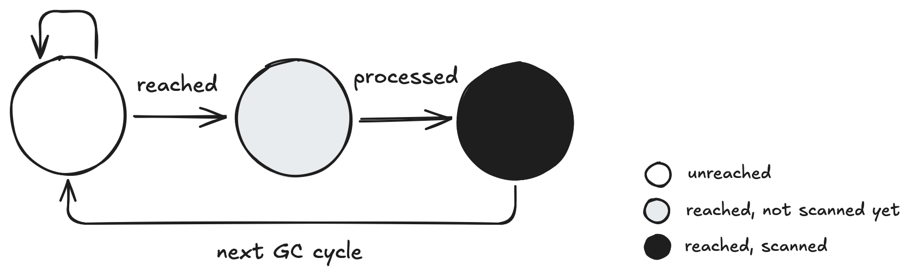

> [!WARNING] Disclaimer
> This post was written while Go 1.25 is the mainstream release. Some implementation details may change as the Go team continues to refine the garbage collector. Still, the ideas here should remain useful for building an intuition about what happens under the hood and why certain design choices exist. If you need the most up-to-date specifics, always refer to the official Go source and release notes.


I was reading [Efficient Go](https://www.oreilly.com/library/view/efficient-go/9781098105709/) and came across the section on garbage collection (GC). I realized how little I actually knew about such an important topic. Both out of curiosity and for the fun of learning things, I decided to learn a bit more about how it works. So, I looked into many different resources [^resources] and wrote down my understanding to make it stick. This post is the result. I hope it becomes useful for you as well.

Also, special thanks to my friends [Onur](https://blog.aiono.dev) and [Oussama](https://github.com/singularhomology) for their early feedbacks and some clarifications.

[^resources]: In a way, this post is the result of my overall understanding and summary of the things I learned from resources such as some of the official Go blog posts (like, [A Guide to the Go Garbage Collector](https://go.dev/doc/gc-guide), [Go GC: Prioritizing low latency and simplicity](https://go.dev/blog/go15gc), the ISMM keynote [Getting to Go: The Journey of Go's Garbage Collector](https://go.dev/blog/ismmkeynote) ), the [Memory Efficiency: Mastering Go's Garbage Collector](https://goperf.dev/01-common-patterns/gc/) from the [Go Optimization Guide](https://goperf.dev/), and of course the [Eficient Go](https://www.oreilly.com/library/view/efficient-go/9781098105709/) book. Oh, and also some  Wikipedia entries as well.

# Introduction

Go is a garbage-collected language. This is great for developer velocity. It allows us to spend less time on manual memory management and more on business logic. Unfortunately though, making GC work efficiently is neither simple nor cheap.

The thing is, just because GC hides memory management details from us doesn't mean that they don't happen under the hood. They happen, and they are costly. If we don't think about it, we might just generate garbage without realizing the possible runtime costs.

> Think of a garbage collector like a Roomba: Just because you have one does not mean you tell your children not to drop arbitrary pieces of garbage onto the floor.
>
> \- Halvar Flake

Thus, **by seeing the actual costs involved with GC, we can better appreciate the complexity of the problem it's solving. Thus, we might feel more motivated to write code that creates less garbage.** At least, that was my experience.

For this, in the following sections, I will examine the Go Garbage Collector in more detail. I will examine its trigger policy, how it frees or rearranges memory, and the side effects of these actions. I will also talk about what we can do to help the GC, so that our applications suffer less from latency caused by poorly managed memory.

# The Pacing Problem

Now, even if we had a procedure for cleaning up garbage, unless we trigger it, we are basically no better of. So, any garbage collector, in a way, requires a mechanism for determining when to trigger the collection process.

Honestly, if I were to implement such a trigger mechanism for the first time, the first idea that would come to my mind would be to simply trigger the GC periodically at a fixed interval. But, even a little bit of thought shows the problem here. A fixed interval does not care whether the program is allocating a lot or very little. What about something like triggering the GC after allocating memory a determined number of times? Likewise, this approach would also likely fail. Because it simply ignores the fact that allocations can have very different sizes and lifetimes.

So, **whatever mechanism we come up with, it better should adapt to the program’s behavior.** It needs to monitor how fast memory is being allocated and how quickly old objects become unreachable, then decide when to run the collector accordingly.

> [!TIP] The Pacing Problem
> Running the GC too often or too rarely can both cause serious problems:
>
> **If the GC doesn't run often enough**, memory usage grows too quickly. When it finally runs, it has to clean a much larger area, which takes more CPU time than if collections had been more frequent.
>
> **If the GC runs too often**, it wastes precious CPU cycles by checking for garbage before enough has accumulated. This means extra work with little benefit.
>

It's a bit like cleaning your house: **If you never clean and let garbage pile up, you waste space and also make the next cleaning much harder. If you keep checking a clean room again and again, you're just wasting time.**

Fortunately, Go takes a smarter approach by using a special mechanism to decide when to trigger garbage collection. This mechanism is called the pacer.

# How Does The Pacer Work?

> [!NOTE] Go's GC Pacer Source Code
> Those who are curious about how the pacer works in more detail can read the [runtime/mgcpacer](https://go.dev/src/runtime/mgcpacer.go). It is not that hard to follow and only about 1500 lines of code (comments included).

The main idea behind Go's pacer is to keep garbage collection proportional to the rate of memory allocation. Basically, after each collection, the GC measures the size of the live heap (the memory still in use after collection) and some additional parameters to compute the next target.

Here is a piece of code from [runtime/mgcpacer](https://go.dev/src/runtime/mgcpacer.go#L1233) demonstrating how the heap goal is calculated.

```golang
// Compute the next GC goal, which is when the allocated heap
// has grown by GOGC/100 over where it started the last cycle,
// plus additional runway for non-heap sources of GC work.
gcPercentHeapGoal := ^uint64(0)
if gcPercent := c.gcPercent.Load(); gcPercent >= 0 {
   gcPercentHeapGoal = c.heapMarked + (c.heapMarked+c.lastStackScan.Load()+c.globalsScan.Load())*uint64(gcPercent)/100
}
// Apply the minimum heap size here. It's defined in terms of gcPercent
// and is only updated by functions that call commit.
if gcPercentHeapGoal < c.heapMinimum {
   gcPercentHeapGoal = c.heapMinimum
}
c.gcPercentHeapGoal.Store(gcPercentHeapGoal)
```

Here, `heapMarked` is the number of bytes marked by the previous GC. It is the part of the heap that survived the last collection, and also known as the "live heap". The `lastStackScan` is the number of bytes of stack that were scanned last GC cycle and `globalsScan` is the total amount of global variable space that is scannable. There is also one last value to talk about `gcPercent`. It is the growth percentage. It comes from `GOGC` and defaults to `100`, which means the next goal allows roughly a 100 percent growth over the base term.

> [!NOTE] Target Heap Memory
> [A Guide to the Go Garbage Collector](https://go.dev/doc/gc-guide#GOGC), summarizes this calculation of the target heap memory as:
> ```
> Target heap memory = Live heap + (Live heap + GC roots) * GOGC / 100 
> ```
> Here, I find the addition of `GC roots` rather interesting. Why add them into the equation in the first place? Why not use something as simple as the following example?
> 
>```
>Target heap memory = (1 + GOGC/100) * Live Heap
>```
> It turns out that it was already like this until Go v1.18. It seems like the main motivation for this change was to make the GC's pacing model reflect all of the work the collector needs to perform, not just the size of the heap. Those who are further interested in the topic, can look up the [GC Pacer Redesign](https://github.com/golang/proposal/blob/master/design/44167-gc-pacer-redesign.md) proposal that initiated the change.

Regardless of these details, the main idea is still the same: we have a pacer that basically keeps the garbage collector in sync with the program’s allocation behavior. It constantly adjusts when the next collection should happen based on how the heap grows and how much work the previous GC cycle required.

> [!NOTE] The `GOMEMLIMIT` Option
> Go also provides an option called `GOMEMLIMIT`. When the process approaches this limit, the pacer logic triggers the GC immediately, without prior checks. It serves as another pacing mechanism, but one focused on memory pressure rather than allocation rate.
>
> However, this option is a tricky one. The _Efficient Go_ especially warns us about it:
> > **When your program allocates and uses more memory than the desired limit with the `GOMEMLIMIT` option set, it will only make things worse.** This is because the GC will run nearly continuously, **consuming around 25% of the CPU time** that could otherwise be used by your program.


At this point, we have discussed how the pacer calculates the next target for heap memory after a collection. But this still leaves the question: **where do we actually compare the current heap memory with the target heap memory to trigger the GC?**

As I understand, there are two main places:

1. **The [runtime/malloc.go](https://go.dev/src/runtime/malloc.go) implementation**: For each large allocation (roughly greater than 32 KB), the GC always checks whether the heap has passed the GC trigger threshold. For small allocations, it performs the check only after enough space has been allocated over time, similar to waiting for sufficient allocation activity to occur. Those interested in the details can examine `mallocgc` and, in particular, its helper functions: `mallocgcTiny`, `mallocgcSmallNoscan`, `mallocgcSmallScanNoHeader`, `mallocgcSmallScanHeader`, and `mallocgcLarge`.

2. **The `forcegchelper` goroutine defined and being run in [runtime/proc.go](https://go.dev/src/runtime/proc.go#L359)**. It basically runs GC if it does not run for a certain period of time defined by the constant `forcegcperiod`.

In addition to these, we can also trigger the GC manually via `runtime.GC()` and `debug.FreeOSMemory()`. I guess they can be helpful in cases where we want to reclaim memory deterministically or prepare for a memory-heavy phase. But in many cases we don't need this, or simply using better patterns is a better idea.

[^gogc-example]: Let's try to understand how `GOGC` is being used to set a new heap target. When the program starts there is no last time for the garbage being collected. So, as a default value, Go GC uses 4MiB. After this, once the live heap crosses 4MiB, first GC gets triggered. For example, if the live heap is 6 MiB after the first collection and `GOGC=100`, the next trigger will be at 12 MiB. If, after that collection, the heap shrinks to 5 MiB, then the following trigger will be set at 10 MiB. This process repeats after each collection cycle.

[^minimal-total-heap-size]: [GOGC](https://go.dev/doc/gc-guide#GOGC) section of the  "A Guide to the Go Garbage Collector" documentation notes that "the Go GC has a minimum total heap size of 4 MiB, so if the GOGC-set target is ever below that, it gets rounded up."

# How Does The Collection Works?

The Efficient Go book summarizes how Go's GC works as follows:

> The Go GC implementation can be described as the [concurrent, nongenerational, tri‐color mark and sweep collector](https://www.ardanlabs.com/blog/2018/12/garbage-collection-in-go-part1-semantics.html) implementation. Whether invoked by the programmer or by the runtime-based `GOGC` or `GOMEMLIMIT` option, the `runtime.GC()` implementation comprises a few phases. The first one is a mark phase that has to:
>
> 1. Perform a “stop the world” (STW) event to inject an essential write barrier (a lock on writing data) into all goroutines. Even though STW is relatively fast (10– 30 microseconds on average), it is pretty impactful—it suspends the execution of all goroutines in our process for that time.
> 2. Try to use 25% of the CPU capacity given to the process to concurrently mark all objects in the heap that are still in use.
> 3. Terminate marking by removing the write barrier from the goroutines. This requires another STW event. After the mark phase, the GC function is generally complete. As interesting as it sounds, the GC doesn't release any memory! Instead, the sweeping phase releases objects that were not marked as in use. It is done lazily: every time a goroutine wants to allocate memory through the Go Allocator, it must perform a sweeping work first, then allocate. This is counted as an allocation latency, even though it is technically a garbage collection functionality—worth noting!

So, I know this is a lot to take in if you're learning about garbage collectors for the first time. What does **“concurrent, nongenerational, tri-color mark-and-sweep collector”** even mean? Let's explain these terms one by one. I'll start with the **tri-color mark-and-sweep** part, it's the core idea behind how the GC identifies and frees unused memory. After that, I will move on to explaining the **concurrent** and **nongenerational** parts.

> [!NOTE] Objects and Garbages
> 
> You will encounter the term "Object" quite a lot during discussions related to GC. What it means is any value or data structure that resides in the heap. Garbages are basically objects that are no longer pointed by any reachable reference (or root).


## Tri-color Mark and Sweep

The **tri-color mark-and-sweep** algorithm is the main technique that Go's garbage collector uses to determine which parts of memory are still in use. It belongs to the family of [Tracing GC](https://en.wikipedia.org/wiki/Tracing_garbage_collection) algorithms. They are called tracing collectors because, instead of something like tracking how many active references point to a given object (aka [reference counting](https://en.wikipedia.org/wiki/Reference_counting)), they start from a set of known roots and trace through every reachable object. **The main idea is simple; Anything that cannot be reached during this traversal is unused and thus, can be used by the allocator.**

The tri-color in the name refers to how the objects are categorized into different groups during the tracing phase. During the scan (tracing), the collector needs a way to separate objects that are known to be reachable and completed, objects that are reachable but still need to be processed, and objects whose reachability is still unknown. So, it classifies objects into three groups:

\- **White** for objects that have not been reached yet. \
\- **Gray** for objects that have been reached, but whose children still need to be scanned. Gray objects are basically in-progress to become black. \
\- **Black** for objects that are confirmed reachable and fully processed, including everything they point to.

The diagram below shows how objects move between these states:



At the start of a garbage collection cycle, every object begins in the white set. The collector scans the roots and moves the objects they reference into the gray set. As it continues to follow pointers, any newly discovered object moves from white to gray. A gray object becomes black once all of its children have been scanned. By the end of the cycle, all reachable objects become black, and anything that remains white is considered unreachable. This process is repeated every time a new collection starts.

> [!WARNING]
> Keep in mind that this description is just an oversimplified, conceptual model of how Go's collector behaves. The actual implementation does not store literal colors on objects and uses internal bitmaps, spans, and work queues to represent these states efficiently. If you want to see how this works in practice, the relevant code lives in [src/runtime/mgcmark.go](https://go.dev/src/runtime/mgcmark.go) and [src/runtime/mgcsweep.go](https://go.dev/src/runtime/mgcmark.go) in the Go source tree.

## Concurrent

**Concurrent** means that the GC runs alongside our goroutines most of the time rather than stopping everything. As it's explained in the [Memory Efficiency and Go's Garbage Collector](https://goperf.dev/01-common-patterns/gc/#concurrent) (and visualized below, using the explanation provided there), there are only two parts where "stop the world" occurs: When creating write barriers before the marking phase begins, and when removing those barriers after marking is complete.


Here, I think it's important to realize that Go's GC does not stop goroutines to perform the actual marking of unused pointers. It only pauses them briefly to install the write barriers. Another point worth noting is that these write barriers do not block. A barrier might sound like something that halts execution (which was my first impression too), like a mutex, but it's not that. It doesn't stop anything. It just acts like a small guard that notifies the GC whenever a pointer write happens.

> Write barriers ensure correctness while the application mutates objects during concurrent marking. These barriers help track references created or modified mid-scan so the GC doesn't miss them.
>
> [Memory Efficiency: Mastering Go's Garbage Collector](https://goperf.dev/01-common-patterns/gc/)

So, Go's GC doesn't block other Goroutines most of the time, except for those tiny moments when it adds or removes the write barriers. I found this trick of introducing barriers pretty clever.

## Nongenerational

**Nongenerational** just means Go is not generational. And what does generational mean? Well, it's basically treating objects differently depending on how long they've been around and how often they're accessed. Why? Because they can use this information to optimize collection cycles. Most objects die young. So, by focusing on recently created ones more often, the GC can reclaim memory faster without scanning the entire heap each time. This is interesting. But if this approach is so efficient, why doesn't Go do the same? Apparently, the reason is that there was no obvious benefit to it, that is, the benefits were not sufficient enough. [^why-nongenerational]

[^why-nongenerational]: As for why Go is non-generational, [Go Optimization Guide](https://goperf.dev/01-common-patterns/gc/#non-generational) notes that "it hasn't shown clear, consistent benefits in real-world Go programs with the designs tried so far." The ISMM keynote, [Getting to Go: The Journey of Go's Garbage Collector](https://go.dev/blog/ismmkeynote) also explains that while generational collectors can help reduce long stop-the-world pauses, Go's concurrent GC already avoids those and instead focuses on maintaining low, predictable latency.

# To Conclude

The more I read about how Go's garbage collector works, the more I realize how deep the topic goes. It is absolutely possible to study every corner of the runtime, but that wasn't the goal of this essay. My goal was to build a practical understanding of the system and develop an intuition for the bigger picture. I think, at this point, it’s enough to recognize that the Go team [prioritized low latency and simplicity](https://go.dev/blog/go15gc).

I think we've covered quite a bit in this blog post; The pacing problem, how the collection itself works, some of the implementation details, and so on... I believe, **If there's one thing to take away from all of this, it's that we should stay mindful of the garbage our code generates. Even though the GC hides it from us, it still happens under the hood and has real effects on how our programs perform.** In _Helping Out The Go's GC_ essay, we are going to look into some of the practical things we can implement to achieve this.

I hope this post helped you build a clearer intuition about how Go's garbage collector works. It sure helped me a lot. If you spotted something I missed, or have other insights worth sharing, I'd  love to hear about them.

Thanks for reading all the way through...

# BONUS: The Green Tea Garbage Collector

As I'm writing this, there's an ongoing effort to make Go's garbage collector even more performant. The work is part of a new proposal called "Green Tea GC". You can follow the discussion and progress in [this issue](https://github.com/golang/go/issues/73581) on GitHub.

